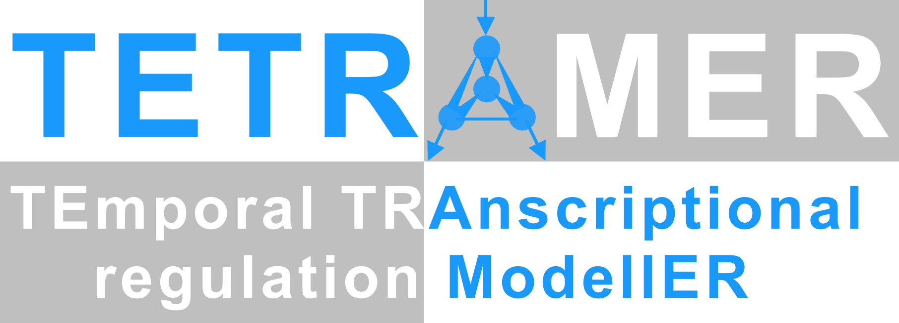

# Overview
------

### Multilayer
------

Coming soon.

#### Tetramer
------

------

<strong>TETRAMER</strong> provides a user-friendly framework for the <strong>reconstruction of cell fate transition-specific gene regulatory networks (GRNs)</strong> by integrating user-provided temporal transcriptomes with generic GRNs derived from (i) the analysis of multiple publicly available gene expression profiles associated to several mouse or human cell type/tissues (CellNet; http://cellnet.hms.harvard.edu/); (ii) the genome-wide mapping of human promoters and enhancers in multiple cell type/tissues from CAGE data generated by the FANTOM5 consortium (regulatory circuits http://regulatorycircuits.org/); as well as (iii) the systematic analysis of most publicly available ChIP-sequencing data corresponding to TF-binding in a variety of human or mouse cell type/tissues: http://ngs-qc.org/. Furthermore, <strong>TETRAMER provides an iterative approach for interrogating the capacity of each TF</strong>, retrieved on the GRN, <strong>to drive cell fate transformation.</strong> For it the temporal transcriptional regulation cascade derived from each TF is scrutinized as a way to verify its influence on the reconstitution of the differential gene expression patterns associated to the cell fate transformation.

